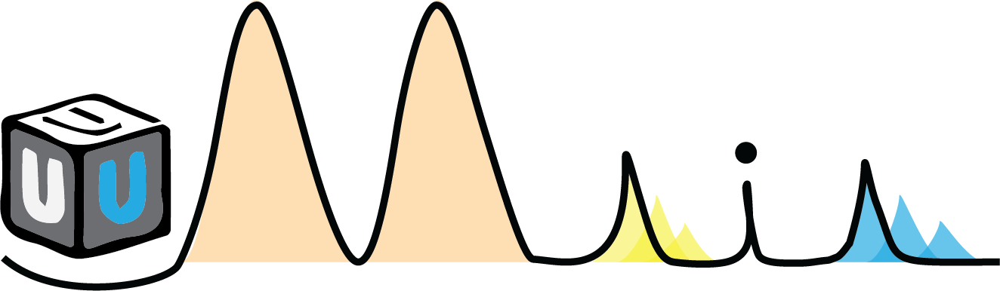

# uMAIA
Toolbox for the processing and analysis of MALDI-MSI data

## Installation

To begin, create a new environment with 
`conda create --name uMAIA_env python==3.9`

activate the environment with
`conda activate uMAIA_env`

conda install jupyter with
`conda install jupyter`

install the required packages
`pip install -r requirements.txt`

If you are experiencing issues during the installation with caches files, you may need to remove them.
You can do so with the following commands:
`conda clean -a`
`python -m pip cache purge`
`rm ~/.cache/pip -rf`
`conda update --all`

### Gurobi
The molecule matching portion of the pipeline requires Gurobi. You will need to (1) install the Gurobi installer and (2) activate a license that is free for those are affiliated with an academic institution. Concerning (1), download the archive with 

Linux:
`wget https://packages.gurobi.com/9.1/gurobi9.1.2_linux64.tar.gz` to the directory you want to install it in.
or MacOS:
`https://packages.gurobi.com/9.1/gurobi9.1.2_macos_universal2.pkg`

Unpack the archive with

Linux:
`tar -xzvf gurobi9.1.2_linux64.tar.gz`
or on MacOS, simply double click the .pkg file and walk through the installation instructions

Activate the license with

Linux:
`gurobi912/linux64/bin/grbgetkey <licensekey>`
MacOS:
`grbgetkey <licensekey>`

### GPU usage restrictions
If you intend on applying uMAIA's normalisation algorithm on a GPU, please note that JAX will automatically use between 75 and 90 % of available GPU memory. To indicate that you would only like to allocate memory that is needed, you may export an environment variable after activating the environment with `export XLA_PYTHON_CLIENT_PREALLOCATE=false`

